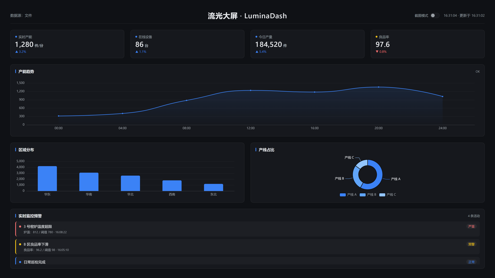

# LuminaDash · 流光大屏

> 基于 Vue 3 的数据可视化大屏，对接真实 tsar 监控数据，主打极简中性深色风格与数据驱动渲染。

[](https://github.com/shoushou100/LuminaDash)
[](./LICENSE)
[](https://vuejs.org/)
[](https://vitejs.dev/)
[](https://echarts.apache.org/)
[](https://www.typescriptlang.org/)
[](https://github.com/shoushou100/LuminaDash)



## ✨ 特性

- 🎨 **极简中性深色主题**：单一强调蓝 `#3b82f6`，去除霓虹光晕与渐变，留白充足、信息层级清晰。
- 📊 **数据驱动大屏**：界面区块完全由 `src/data/manifest.json` 声明，自动渲染对应图表，无写死业务预设。
- 📈 **真实监控数据**：对接 tsar 系统监控数据（CPU / 内存 / 磁盘 / 网络），支持 7 天时间序列与 20 台主机快照。
- 🔢 **KPI 按位滚动动画**：仅变化的数字位滚动，未变位保持静止，过渡自然。
- 📐 **自适应大屏**：基于 `autofit.js` 的 1920×1080 设计稿等比缩放，适配不同分辨率。
- 🔌 **可切换数据源**：通过 `VITE_DATA_SOURCE` 在 `file`（本地 JSON）与 `api`（REST）之间切换。
- 📸 **一键自动化截图**：CLI 循环/单次截图，网页内「截图模式」开关即开即停，便于验收与资料引用。

## 🖼️ 界面预览

上图为运行中的大屏截图，由项目内置截图能力自动生成（见 [📸 自动化截图](#-自动化截图)）。如需重新生成，执行：

```bash
npm run screenshot:once
```

截图默认输出到 `pic/`，并同步刷新可用于文档的 `docs/preview.png`。

## 🚀 快速开始

```bash
# 克隆仓库
git clone https://github.com/shoushou100/LuminaDash.git
cd LuminaDash

# 安装依赖
npm install

# 启动开发服务器（默认 http://localhost:5173）
npm run dev

# 构建生产版本
npm run build

# 本地预览构建产物
npm run preview
```

## ⚙️ 环境变量

通过项目根目录的 `.env.development` / `.env.production` 配置：

| 变量 | 说明 | 默认值 |
| --- | --- | --- |
| `VITE_DATA_SOURCE` | 数据源模式：`file`（本地 JSON）或 `api`（REST 接口） | `file` |
| `VITE_API_BASE_URL` | `api` 模式下的接口基础地址 | `/api` |
| `VITE_REFRESH_INTERVAL` | 实时数据刷新间隔（毫秒） | `3000` |

自动化截图的 CLI 参数（非环境变量）：

| 参数 | 说明 | 默认值 |
| --- | --- | --- |
| `--once` | 只截图一张即退出 | 关闭（循环） |
| `--dir <路径>` | 截图输出目录 | `pic` |
| `--interval <毫秒>` | 循环截图间隔 | `60000` |
| `--scale <1\|2>` | 截图清晰度（设备像素比） | `2` |

## 🧩 目录结构

```
LuminaDash/
├── data/                        # 原始监控数据（tsar .dat 文件）
│   ├── disk_tsar.dat            # 磁盘 I/O 时间序列
│   ├── pref_tsar.dat            # CPU/内存/网络/负载时间序列
│   ├── host_detail.dat          # 主机明细（20 台）
│   └── mod_detail.dat           # 指标元数据映射
├── scripts/
│   ├── import-dat.mjs           # 解析 data/ 下 .dat 并生成 src/data/*.json
│   ├── screenshot.mjs           # CLI 自动截图（循环 / 单次）
│   └── screenshot-core.mjs      # 截图核心逻辑（CLI 与 dev 中间件共用）
├── src/
│   ├── main.ts
│   ├── App.vue
│   ├── core/
│   │   ├── config/              # env.ts（环境变量）、chart.ts（图表主题）
│   │   ├── logger/              # 轻量日志
│   │   └── utils/               # 工具函数
│   ├── stores/
│   │   └── dashboard.ts         # Pinia 全局状态
│   ├── services/
│   │   └── datasource/          # DataSource 抽象 + File / Api 实现
│   ├── data/                    # 前端可读的 JSON 数据（由 import-dat.mjs 生成）
│   │   ├── manifest.json        # 区块声明（title + chart 类型）
│   │   ├── core.json            # 核心指标快照
│   │   ├── trend.json           # 时间序列趋势
│   │   ├── hosts.json           # 主机对比数据
│   │   └── alerts.json          # 实时监控预警
│   ├── modules/
│   │   ├── layout/              # ScreenContainer 大屏布局
│   │   ├── charts/              # 折线 / 柱状 / 饼图 / 仪表盘 / 地图
│   │   └── widgets/             # KpiCard / PanelHeader / AlertPanel / ScreenshotToggle
│   ├── styles/                  # theme.css / global.css
│   └── tests/
│       ├── unit/                # Vitest 单元测试
│       └── e2e/                 # Playwright 端到端测试
├── docs/
│   └── preview.png              # 预览图（自动生成，随仓库提交）
├── pic/                         # 截图输出目录（已被 .gitignore 忽略）
├── package.json
├── vite.config.ts               # 含截图控制中间件 /api/screenshot/*
├── playwright.config.ts         # e2e 测试配置
└── tsconfig.json
```

## 📸 自动化截图

项目内置基于 Playwright 的自动截图能力，适用于 README 展示、课程资料引用、多 AI 协作验收与视觉检查。

**方式一：命令行（CI / 单次生成）**

```bash
# 单次截图：生成一张即停，输出到 pic/ 并刷新 docs/preview.png
npm run screenshot:once

# 循环截图：每 60 秒自动保存一张带时间戳的截图，Ctrl+C 停止
npm run screenshot
```

**方式二：网页内开关**

页面右上角提供「截图模式」开关：

- 打开：经 `vite.config.ts` 中间件 `POST /api/screenshot/start` 启动截图循环；
- 关闭：经 `POST /api/screenshot/stop` 停止。

截图统一保存到 `pic/`，并同步生成 `docs/preview.png`（可提交入库的预览图）。

## 🧪 测试

```bash
# 单元测试（Vitest）
npm run test

# 端到端测试（Playwright）
npm run test:e2e
```

> 首次运行 e2e 需安装浏览器：`npx playwright install chromium`

## 🤝 贡献

欢迎提交 Issue 与 Pull Request，一起完善流光大屏！

## 📄 开源协议

本项目基于 [MIT License](./LICENSE) 开源。

## 🔗 相关链接

- 仓库地址：<https://github.com/shoushou100/LuminaDash>
